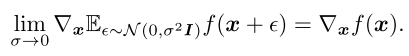

# Experiment: Goodfellow GAN

**Executive Summary**: The original Goodfellow GAN is recreated in pytorch in this framework. It is run on MNIST, to start. 

`adv version` (git hash): `45940a95d572a8903011aa5bb4efdec3343c035d`

# Introduction

To gain a better understanding of GANs, their construction, and how gradients evolve, this experiment starts with Dr. Ian Goodfellow's original GAN network architecture. A simple baseline check is run to sanity-check the implementation correctness, but is not of particular concern for the larger experiment. 

Once implemented, a secondary evaluation on visualizing the adversarial gradients will be performed - this is to be on on all of the network architectures and adversarial attack types. 

paper: _Generative Adversarial Nets_. Goodfellow et al 2014. \[[arxiv](https://arxiv.org/abs/1406.2661)\] \[[original code](https://github.com/goodfeli/adversarial/)\]  

# Methods

(abbreviatd from the paper)   

Generator, _G_: MLP  
Discriminator, _D_: MLP   

The generator's distribution _p\_g_ over _x_ is learned via defining a prior on input noise variables _p\_z(z)_ and then representing a mapping to data space as _G(z;theta\_g)_, where _G_ is a differentiable function (of the MLP). The discriminator _D(x;theta\_d)_ outputs a single scalar. _D(x)_ represents the probabilty that _x_ came from the data rather than _p\_g_. 

_D_ optimisation: maximize probabilty of assigning the correct label to training samples and generated.
_G_ optimisation: minimize _log(1-D(G(z)))_: 

Derivatives are backpropgated through the generative process using the observation that: 

Training is performed by alternating between _k_ steps of optimizing _D_ and one step of optimizing _G_. This speeds up completion of training _D_ and helps maintain it near optimal solution. Early in learning, hen _G_ is poor, its minimization function may be saturated, and so the maximization of _logD(G(z))_ is swapped in.  

See algorithm 1 for the minibatch SGD training algorithm. Note that the sgd learning rule used here is momentum. 

Depending on the dataset, ReLU or sigmoid activation functions are used. _D_ uses maxout activations. Dropout is applied during training on _D_. _G_ only employs the noise input _p(z)_. 

## Datasets 

1. MNIST
2. Toronto Face Database 
3. CIFAR-10

# Discussion

# Results 